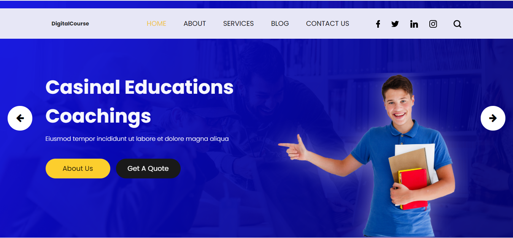

## Introduction

DigitalCourse is an online e-learning platform.

## Informations
-   Status: under development
-   Version 1.0
-   Sector Education
-   Created: October 2020
-   Last updated: October 2020

## Table of contents
* [Documentation](#general-info)
* [Demo](#demo)
* [Screenshots](#screenshots)
* [Technologies](#technologies)
* [Setup](#setup)
* [Features](#features)
* [Status](#status)
* [Contact](#contact)
* [License](#license)

## Documentation
https://github.com/aniskchaou/DIGITAL-COURSE-FRONTOFFICE-USER/wiki

## Demo
https://digital-course.herokuapp.com/

## Screenshots

## Technologies
* PHP
* Laravel

## Setup

## Features
 -  List of courses by category
-   Course registration for teachers
-   Student registration
-   Obtain certification

  

## Contact
contact@delta-dev-software.com

## License
<a href="license.txt">MIT License</a>